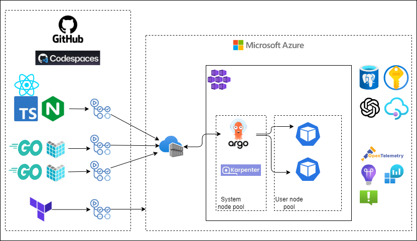

# aks_terraform

## CI/CD概要図



#
docker run --name crud_api-container -d -e SOME_ENV_VARIABLE=prod --env-file "/mnt/c/Users/Regulus/work/aks_terraform/go/.env" -p 8080:8080 crud_api:latest

## ユニットテスト
- gomockでモックを生成する
    ```
    // インストール
    $ go install github.com/golang/mock/gomock

    // mock生成
    $ mockgen -source=path/to/your/interface.go -destination=path/to/your/mock/mock_user_repository.go -package=mock_example
    ```
